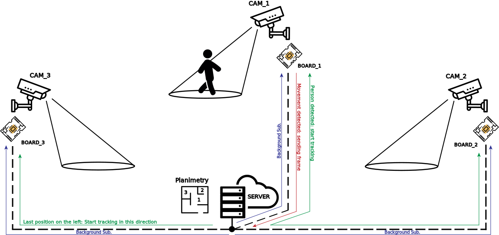

# [PII] ROS - Reimagined Octo-Spork
#### Heterogeneous distributed system for object tracking and fun stuff

This project involves object recognition with Darknet and OpenCV's YOLO algorithm running on a distributed system for object tracking.

Requirements:
---

**Server-side**:
* @pjreddie **[Darknet YOLO](https://pjreddie.com/darknet/yolo/)** (Already included in this repo) - https://github.com/pjreddie/darknet/
  + ***.cfg** that are in this repository have been tweaked to be faster with less powerful NVIDIA GPUs*
  + ***yolov3.weights** + **yolov3-tiny.weights** files are required and need to be placed inside **Server/darknet/***

**Client-side:**
* **OpenCV 3.4.5** - https://github.com/opencv/opencv/releases/tag/3.4.5 
  + **OpenCV_DNN** additional modules - https://github.com/opencv/opencv_contrib/releases/tag/3.4.5
  + Installation guide here: https://docs.opencv.org/3.2.0/de/d25/tutorial_dnn_build.html

* A *LOT* of patience

Installation:
---
After cloning this repository (```git clone https://github.com/DPons97/reimagined-octo-spork.git ```):
* Build darknet inside ```Server/darknet/``` (and test it!)<br>
  Download and place darknet's weights in **Server/darknet/**: 
  ```bash
  wget https://pjreddie.com/media/files/yolov3.weights
  wget https://pjreddie.com/media/files/yolov3-tiny.weights
  ```
  
* Build OctoSpork: 
  ```bash
  cd [...]/reimagined-octo-spork/
  mkdir build
  cmake ..
  make [leave empty if you want to build everything. Otherwise, see below]  
  ```
  If you want to only build Server, change ```make``` line to:
  ```shell
  make OctoSporkServer
  ```
  Otherwise, to build Client only:
  ```shell
  make OctoSporkClient
  ```
  
* If you decided to build Client, you have to move and compile *bkgSubtraction* and *nodeTracker* inside ***Client/Executables***.

Running ROS:
---
cd into the build directory in reimagined-octo-spork
```bash
cd path-to/reimagined-octo-spork/build
```
* Server side:
  ```bash
  ./OctoSporkServer
  ```
* Client side:
  There are two ways to run the client executable:
  * Passing all informations as arguments
  ```bash
  ./OctoSporkClient [ipaddress] [port] [node_id] [node_x] [node_y] [theta] [top_neighbour] [bottom_n] [left_n] [right_n] 
  ```
  * Passing a configuration file
  ```bash
  ./OctoSporkClient [path_to_cfg_file]
  ```
  The configuration file should be a one line file with the arguments you would pass as above.
  
  **NB:** *node_x*, *node_y*, *theta* are respectively the coordinates and the phase displacement of the camera's node. 

Run ROS demo client:
  * node 1 (set cam1 in file path in the executables files)
     ```bash
    ./OctoSporkClient [ipaddress] 51297 1 0 0 0 3 4 5 2 
    ```
  * node 2 (set cam2 in file path in the executables files)
    ```bash
    ./OctoSporkClient [ipaddress] 51297 2 0 0 260 7 8 1 9 
    ```
<br>

Tested Hardware:
---
* Odroid xu4
* Jetson-TX2 with Nvidia Tegra technology
* Any PC with any Linux distribution (Tested on Fedora and Ubuntu)
<br><br>

The idea:
---
The initial goal was to develop a software that involved distributed heterogeneous systems that would be flexible and reusable for different applications.<br>
As we needed to work on a realistic case study, we thought about diving into image recognition and building a distributed tracking system.<br>
First, we did some research to find the algorithms we had at disposal and to select which one was the most suitable for our hardware.<br>
Pjreddie's darknet network is really good concerning detection and it's fast enough on the Jetson but, having to also use an Odroid XU4 (8 cores CPU, no GPU), YOLO's library would result in really high computational times.<br>
Here's where OpenCV's Deep Neural Network module comes in handy: it features a 9x faster implementation of DNN using CPU with the same darknet's yolov3 configuration file.<br>
Some tweaking to the cfg are required to achive an acceptable speed, although trading off some accuracy.<br>
Now let's **talk about the fun stuff.**<br>

How does it work?
---
The ROS system's architecture is based on one SERVER (in our case the Jetson-TX2) and one or more CLIENTS / NODES (Odroid XU4 or any linux pc).<br>
Every client connects to the server sending his planimetry informations (his node's ID and his neighbours' IDs) and waits for new instructions to be executed.<br>
Client nodes relay on a text file to match the instruction ID received from the server with an actual executable that it can run in a new process. In this way the client side is easy to customize (more on that later... ).
The server communicates every node an "idle" operation that is, in our case, a *Background subtraction* process. <br><br>
**NB**: If you are not into detection and tracking systems, there still is something for you. Just skip the next paragraphs and go to *Customizing ROS.* <br><br>



*Icons made by: [Freepik](https://www.freepik.com/?__hstc=57440181.c2013b29b5d74612c3c8cab36bfc0203.1559675594943.1559675594943.1559847167123.2&__hssc=57440181.2.1559847167123&__hsfp=1353452017), [photo3idea-studio](https://www.flaticon.com/authors/photo3idea-studio), [eucalyp](https://www.flaticon.com/authors/eucalyp) from www.flaticon.com*<br>

**NB**: As a lot of people don't have multiple cameras at their disposal, we implemented the video stream as a series of images (https://trac.ffmpeg.org/wiki/Create%20a%20thumbnail%20image%20every%20X%20seconds%20of%20the%20video). <br>
Just remember to change FPS and other parameters inside bkgSubtraction and nodeTracker.<br>

### Background subtraction
During this initial phase every client applies background subtraction (provided by OpenCV) to a given video stream.<br>
Once a blob that is big enough is detected, the node sends last frame that was analyzed to the server to run a first object detection in search of certain user-defined objects.<br>
If something is found (inside our project we search for people), a new *Tracking* instruction is sent to the node that found the blob.<br>

### Tracking
If a client receives this instruction, it starts tracking the defined object that should be in his sight.<br>
For every frame that has the object in it, the node saves detected box's coordinates and tries to estimate distance from the camera (with bad results, for now :neutral_face:).<br>
When the object is no more in sight of the client's camera, the server receives all saved coordinates and analyze them to decide whether it could keep tracking through other connected cameras.<br>
This is possible thanks to the planimetry that is stored inside server.<br>

<br>
Customizing ROS:
---
Customization was our main focus through the development of the project. 

### Client-side customization
As mentioned above, nodes customization is acheived through a map file that associates an ID with a corresponding executable (**Client/Executables/executables.txt**).<br>
When the client receives a message it first checks if it's asking to kill a process or to start a new one.<br>
In case it needs to start a new one, it looks up the corresponding executable and parses the parameters (if present). <br>
It then opens a new socket connection to bind to the new process. At this point the client forks and the child will start the executable. <br>
Eventually the main process comunicates the pid of the new task to the server and starts to listen for new instructions again.<br>

*The ClientNode should not need any modifications, it just parses messages and set up the new task.*<br>

**How to structure new executables:**<br>
New executables always take at least one parameters, the socket with which it communicates with the server. <br>
If you want you can add additional parameters. The server will comunicate them to the task when sending the execution instruction to the client. 

The client could receive a message from the server asking to kill a given pid. In this case ClientNode will send a SIGTERM to the received pid (if it still running).
*You may want your executables to handle this signal in order to perform a clean exit of the task.*


### Server-side customization
Unlike client, ROS Server has to be customized directly from the source code, as it's composed of only one generic class: **Instruction.cpp** (you can find source code inside *Server/Instructions*).<br>
Basically, an object of type *Instruction* is provided with all basic functionalities to communicate with a ClientNode:<br>
* Default initializer:
  ```cpp
  Instruction(const string &name, std::map<int, int> &instructions, vector<void*> sharedMemory);
  ```
  **name** is, as the name says, a symbolic identifier of the instruction.<br>
  **instructions** is a map that contains tuples <pid, socket>. Map key is the client process PID that's running the instruction bound to a specific socket (map value *socket*).<br>
  To allow communication between different nodes and instructions inside the same server, a generic optional **sharedMemory** can be passed as parameter (e.g. planimetry). *Remember to cast this to the right data type before using!*<br>
  <br>

* To start a new instruction inside a specific connected node:
  ```cpp
  int startInstruction(int instrCode, std::vector<string> args = std::vector<string>());
  ```
  Where **instrCode** is the instruction ID you defined inside *Client/Executables* bound to the relative executable, and **args** are all arguments you want the node to receive (e.g. inside tracking, the object ID to track is one additional argument passed). <br>
  The return value is a new socket, which binds server to current node executable.<br>
  <br>
  
* If during the execution of your program you need to receive an image, you can use:
  ```cpp
  bool getAnswerImg(int rcvSocket, cv::Mat& outMat);
  ```
  Here **rcvSocket** is the receving socket (90% of the times it'll be your instruction socket), whereas **outMat** is a reference to a new OpenCV Mat where the received image will be stored.<br>
  <br>
  
* To stop (or force) a specific instruction and disconnect the relative socket:
  ```cpp
  void disconnect(int instrPid = 0);
  ```
  Where **instrPid** is the instruction node PID.<br>
<br>

<br>

#### Project Contributors:
* Luca Collini [@Lucaz97](https://github.com/Lucaz97) - luca.collini@mail.polimi.it
* Davide Pons [@DPons97](https://github.com/DPons97) - davide.pons@mail.polimi.it
<br>  
